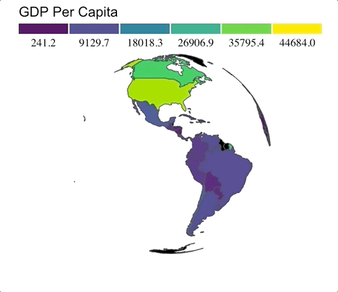

# quickglobe

> Spin's the name, and rocking round the globe's the game!

This package was mostly an excuse to sync up some #rstats, GIS, and D3 tricks. 

I really wanted to name this package `spintheglobe` in homage to [National Geographic's Really Wild Animals](https://en.wikipedia.org/wiki/Really_Wild_Animals) docs, but the internet has a severe deficit of Spin content. 

## Installation

`quickglobe` is not on CRAN, but uou can install the development version from GitHub via:

``` r
devtools::install_packages_github("daranzolin/quickglobe")
```

## Spinning the Globe

`quickglobe` renders an interactive, 3D globe. It will attempt to match a country 'identifier' (e.g. name, iso code) within the function, so there's no need to worry about geometry or other spatial concerns. Your identifier strings, however, have to be relatively clean.

``` r
library(gapminder)
library(dplyr)
library(quickglobe)

gapminder %>% 
  filter(year == 2002) %>%
  quickglobe(country, gdpPercap, title = "GDP Per Capita")
```



## Styling the Globe

Use different palettes, adjust the title font family, choose the number of legend cells, and format the legend ticks in `qg_style`
